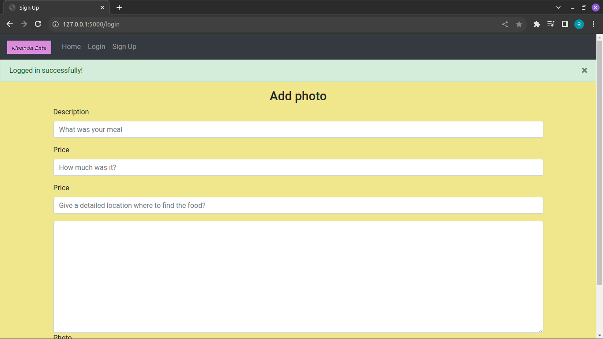

# Kibanda Eats


## Description

The Kibanda Eats project aims to assist low and mid-level earners in finding affordable and healthy meal options conveniently as they navigate through their daily activities. Developed as a solo project, the focus was on implementing CRUD functionality for logged-in users, allowing them to Create, Retrieve, Update, and Delete posts on the app. Additionally, general users can benefit from the app by browsing and searching through existing posts.

## Table of Contents

1. [Kibanda Eats](#kibanda-eats)
2. [Description](#description)
3. [Getting Started](#getting-started)
4. [Technologies Used](#technologies-used)
5. [Images](#images)
6. [License](#license)

## Getting Started

To start using Kibanda Eats, follow these steps:

### 1. Clone the Repository

Clone the project repository from GitHub to your local machine using the following command:

```bash
git clone https://github.com/doni-robert/Kibanda_Eats.git
```
### 2. Set Up the Environment

Navigate to the project directory and create a virtual environment using `virtualenv` or `venv`:

```bash
cd Kibanda_Eats
virtualenv venv
```
#### On Windows
```bash
venv\Scripts\activate
```

#### On macOS and Linux
```bash
source venv/bin/activate
```

### 3. Install Dependencies

Install the project dependencies using `pip`:

```bash
pip install -r requirements.txt
```

### 4. Set Up the Database

Ensure that you have MySQL installed and running on your system. Create a new MySQL database for the project.

Configure the database connection by setting the following environment variables:

```bash
export DB_USERNAME=your_mysql_username
export DB_PASSWORD=your_mysql_password
export DB_HOST=your_mysql_host
export DB_NAME=your_mysql_database_name
```

### 5. Run the Application

Once the environment is set up and dependencies are installed, you can run the Flask application using the following command:

```bash
python app.py
```

### 6. Access the Application

Open a web browser and navigate to `http://localhost:5000` to access Kibanda Eats application.

### 7. Explore the Features

- If you're a general user, browse through the existing posts to find affordable and healthy eateries near you.
- If you're a logged-in user, sign up or log in to access additional features such as creating, updating, and deleting your posts.

## Technologies Used

The project utilizes a combination of front-end and back-end technologies to deliver its functionality efficiently. Below are the main technologies employed in the project:

### Front-end Technologies

- **Bootstrap 4**: Bootstrap is a popular front-end framework for building responsive and mobile-first websites. It combines HTML, CSS, and JavaScript components to create a visually appealing and user-friendly interface. Bootstrap 4 was chosen for its robust set of pre-designed components and its ability to ensure consistency and responsiveness across different devices and screen sizes.

### Back-end Technologies

- **Flask**: Flask is a lightweight and flexible web application framework for Python. It provides tools, libraries, and patterns to build web applications quickly and efficiently. Flask was selected for its simplicity, ease of use, and extensibility, making it an ideal choice for developing the Affordable Meals Finder backend.

### Database Technology

- **MySQL**: MySQL is a popular open-source relational database management system. It offers a scalable, reliable, and high-performance database solution for storing and managing structured data. MySQL was chosen as the database technology for the projectdue to its widespread adoption, robust features, and compatibility with Flask.

### Other Technologies

- **Python**: Python is a versatile and powerful programming language commonly used in web development. It was used extensively in the project for server-side scripting, handling HTTP requests, and interacting with the database.

- **Jinja Templates**: Jinja is a modern and designer-friendly templating engine for Python. It allows for dynamic generation of HTML content in Flask applications by combining static template files with dynamic data from Python code.

These technologies were carefully selected to ensure the reliability, scalability, and maintainability of the project while providing an optimal user experience for its users.

## Images




## License

This project is licensed under the MIT License - see the [LICENSE.md](LICENSE.md) file for details.
 
[Visit my blog post](https://medium.com/@irobertndungu/kibanda-eats-portfolio-project-b9bd71cf2498)   

